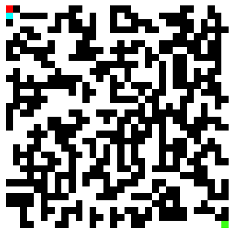

<!--    -->
# Bhushan Ashok Rane

### Howdy!👋

🎓 I am Robotics Software Engineer  
🎮 I'm an avid gamer  
📬 How to reach me : barane@wpi.edu  
<!-- ⚡ Website: [ranebhushan.github.io](https://ranebhushan.github.io/)   -->
<!-- 🔭 I’m currently working on [A](abc) -->

### 🌱 Education  
🔹 **Master of Science in Robotics Engineering** from [**Worcester Polytechnic Institute**](https://www.wpi.edu/) (August 2021 - May 2023)  
🔹 **Bachelor of Technology in Electrical Engineering** from [**COEP Technological University**](https://www.coep.org.in/) (July 2015 - May 2019)   

<!-- 
  
 -->

  <a href="https://github.com/ranebhushan">
  
  

<!--  -->
<!--  -->

## 🔗 Connect with me:

<!--  -->

<!--  -->
<!--  -->
<!-- 
 -->
<!--  -->
<!--  -->
<!--  -->
<!--  -->
<!--  -->

## 💻 Programming Languages:

 
 
<!--  -->

## 🧰 Tools and Technologies:

<!--  -->
 

  
 
 
 
 
 
 

<!-- ## 👨‍💻 Projects:

 -->

<!--
**ranebhushan/ranebhushan** is a ✨ _special_ ✨ repository because its `README.md` (this file) appears on your GitHub profile.

Here are some ideas to get you started:

- 🔭 I’m currently working on ...
- 🌱 I’m currently learning ...
- 👯 I’m looking to collaborate on ...
- 🤔 I’m looking for help with ...
- 💬 Ask me about ...
- 📫 How to reach me: ...
- 😄 Pronouns: ...
- ⚡ Fun fact: ...
-->

<!--  -->
